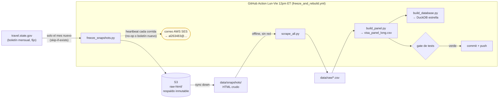

<p align="center">
  
</p>

<h1 align="center" style="color:#003CA6;">VisaPredictAI</h1>

<p align="center">
  <strong>Maestría en Inteligencia Artificial y Analítica de Datos (MIAAD)</strong><br>
  Universidad Autónoma de Ciudad Juárez!
</p>

<p align="center">
  
  
  
  
</p>

---

Pipeline de extracción, anotación, consolidación y auditoría de los datos históricos del [Visa Bulletin](https://travel.state.gov/content/travel/en/legal/visa-law0/visa-bulletin.html) del Departamento de Estado de EE.UU. Es el componente de datos (Objetivo 1) del proyecto de tesis **VisaPredict AI**, que busca predecir fechas de prioridad de inmigración mediante Machine Learning.

## Objetivo

Construir un **panel multiserie** $y_{p,c,b,t}$ (país × categoría × tabla × mes) con las fechas de prioridad publicadas, listo para modelado de series de tiempo.

Los boletines son **fijos** una vez publicados, así que el pipeline es **incremental y orientado a S3**: el HTML crudo de cada mes se congela una sola vez en un bucket S3 (respaldo inmutable de la fuente, que se pudre), y todo lo demás —CSVs, panel y almacén DuckDB— se reconstruye **offline** desde esos snapshots. Una GitHub Action (Lun-Vie, mediodía del Este) solo va a la web a buscar un boletín **nuevo**; si no hay, es un no-op. Cada corrida notifica por correo (AWS SES).

- **5 países o áreas de cargabilidad:** México, India, China, Filipinas y *All Chargeability Areas Except Those Listed* (RoW).
- **Categorías:** Family-Sponsored (F1, F2A, F2B, F3, F4) y Employment-Based (EB-1 a EB-5 con subcategorías, 16 códigos canónicos).
- **Diversity Visa (DV):** cortes de rango por 6 regiones (dataset aparte `fact_dv_rank`, valor = número de rango, no fecha).
- **Dos tablas evaluadas por separado:** *Final Action Dates* (FAD) y *Dates for Filing* (DFF).
- **Cobertura:** serie mensual homogénea desde **diciembre de 2001** hasta el presente (~290 observaciones por serie). Los boletines previos a 2001 existen solo en fuentes de archivo/estadística.

## Qué es el Visa Bulletin

Boletín mensual del Bureau of Consular Affairs con dos tablas por categoría:

- **Tabla A -- Final Action Dates (FAD):** fecha a partir de la cual se puede adjudicar la residencia.
- **Tabla B -- Dates for Filing (DFF):** fecha a partir de la cual se puede iniciar el trámite (disponible desde oct-2015).

## Estructura del repositorio

```
VisaPredictAI/
├── visa_common.py                      # helpers compartidos (fetch, parse, estado) — fuente única
├── config.py                           # constantes (países canónicos, epoch, paleta)
├── freeze_snapshots.py                 # ★ único que toca la web: congela SOLO el mes nuevo → S3 (skip-if-exists)
├── scrape_all.py                       # ★ parsea los snapshots OFFLINE → CSVs (sin red)
├── scrape_visa_bulletins.py            # extractores Employment-Based (FAD + DFF), reusados por scrape_all
├── scrape_family_visa_bulletins.py     # extractores Family-Sponsored (FAD + DFF)
├── scrape_dv_visa_bulletins.py         # extractores Diversity Visa (rango regional)
├── build_panel.py                      # consolida los 10 CSV en el panel largo
├── build_database.py · schema.sql      # carga el esquema estrella DuckDB + Parquet
├── mega_audit.py                      # auditoría exhaustiva de calidad de datos
├── visualize_wait_times.py             # gráficas por país (artefactos no versionados)
├── vp_model/                           # capa de modelado (PI-I) + palette.py (paleta única) + plots.py (figuras EDA)
├── make_*.py                           # generadores de figuras del .tex → reports/latex/Figures/ (data/eda/fe/result/hero/latinometrics)
├── experiments/                        # scripts de modelado/experimentación PI-I (run_*, improve_*, save_*, sync_*) — se corren desde la raíz
│   ├── generate_web_forecasts.py       # pronósticos a 12 m por serie para la web + archiva la añada en el ledger (make web-forecasts)
│   ├── score_forecasts.py              # evaluación PROSPECTIVA: ledger vs cortes reales (make score-forecasts; ver docs/FORECAST_EVAL.md)
│   └── backfill_vintages.sh            # siembra reproducible del ledger (añada viva + históricas leakage-free + scoring)
├── tools/validate_structure.sh         # valida la estructura cookiecutter (make validate; gate de CI)
├── reports/latex/                      # ★ fuente LaTeX del entregable (Overleaf importa de aquí) + Figures/
├── tests/                              # pytest: parsers · extracción offline · contrato del panel + BD
├── data/snapshots/                     # HTML crudo congelado (gitignored; máster en S3)
├── data/raw/                           # CSVs por país (derivados de los snapshots, versionados)
├── data/processed/                     # visa_panel_long.csv (panel) + .duckdb/.parquet regenerables
├── reports/ · docs/                    # auditorías · web_forecasts/forecast_log/scorecard · data_dictionary · er_diagram · ROADMAP · FORECAST_EVAL
├── Makefile · pyproject.toml           # one-command ops + config ruff/mypy/pytest
└── .github/workflows/                  # ci.yml (lint+type+test) · freeze_and_rebuild.yml (Action Lun-Vie 12pm ET, S3-driven) · watchdog.yml
```

## Arquitectura del pipeline



La única vía de red es `freeze_snapshots.py` trayendo un boletín **nuevo**; el resto reconstruye desde el HTML congelado. Si no hay boletín nuevo, la Action termina en segundos (no-op) y solo manda el correo de heartbeat.

## Requisitos

- Python 3.14 (las dependencias —runtime y dev— están pin-eadas en `pyproject.toml`, fuente única, para reproducibilidad dev↔CI).

## Instalación y uso

```bash
git clone https://github.com/UACJ-MIAAD/VisaPredictAI.git
cd VisaPredictAI
python -m venv ante && source ante/bin/activate   # ante\Scripts\activate en Windows
make install            # dependencias + herramientas dev

# pipeline de un comando
make freeze             # congela SOLO boletines nuevos → data/snapshots/ (red; skip-if-exists)
make scrape             # parsea los snapshots OFFLINE → data/raw/*.csv (sin red)
make panel              # consolida data/processed/visa_panel_long.csv
make db                 # carga el esquema estrella DuckDB + export Parquet
make test               # pytest (parsers + extracción offline + contrato del panel + BD)
make check              # ruff + mypy + pytest
make figures            # gráficas (no versionadas)
```

> En un clone nuevo, `data/snapshots/` está vacío (los snapshots viven en S3).
> `make freeze` los regenera desde la web, o si tienes acceso al bucket:
> `aws s3 sync s3://visapredictai-raw-snapshots/raw-html/ data/snapshots/`.

## Datos de salida

### CSVs por país (`data/raw/{country}[_family]_visa_backlog_timecourse.csv`)

| Columna | Descripción |
|---|---|
| `EB_level` / `F_level` | Categoría: empleo = código canónico (`EB1`…`EB5_RURAL`); familiar = `1`, `2A`, `2B`, `3`, `4` |
| `priority_date` | Fecha de prioridad publicada (parseada) |
| `visa_bulletin_date` | Mes del boletín |
| `table_type` | `final_action` (FAD) o `dates_for_filing` (DFF) |
| `raw_value` | Celda original tal cual se publicó (`01MAY16`, `C`, `U`) |
| `status` | Régimen administrativo: `F`/`C`/`U`/`UNK` (ver abajo) |
| `visa_wait_time` | Tiempo de espera calculado (años, legado) |

### Panel consolidado (`data/processed/visa_panel_long.csv`)

Formato largo con la variable dependiente: `country`, `block`, `category`, `table`, `bulletin_date`, `status`, `priority_date`, **`days_since_base`** (días desde 1975-01-01, solo cuando `status='F'`), `raw_value`.

### Estado administrativo (`status`)

- **`F`** -- se publicó una fecha específica (único objetivo predictivo).
- **`C`** -- *Current*, sin backlog ese mes (anotación descriptiva).
- **`U`** -- *Unavailable*, sin números ese mes (anotación descriptiva).
- **`UNK`** -- celda vacía o no parseable.

### Modelo de datos (almacén estrella en DuckDB)

El CSV plano es el entregable abierto, pero `make db` lo carga además en un
**almacén dimensional en estrella** sobre **DuckDB** (`data/processed/visapredict.duckdb`).
Las invariantes del panel se declaran como **constraints** del esquema (`PK`/`FK`/`CHECK`),
así la base **rechaza en la carga** cualquier fila que viole el contrato.

**11 tablas** + 6 vistas/marts:

- **7 dimensiones** — `dim_area`, `dim_category` (con jerarquía `parent_code`/`preference_level`/`ina_basis`),
  `dim_table`, `dim_date` (con `quarter`), `dim_status` (conforme), `dim_region`, y
  `dim_category_alias` (**bridge de linaje**: cada etiqueta publicada → categoría canónica
  con su ventana de validez).
- **2 hechos** — `fact_priority` (grano área × categoría × tabla × mes; la variable
  dependiente `days_since_base`) y `fact_dv_rank` (**Diversity Visa**: número de rango por
  región × mes, dataset separado, no objetivo predictivo). `dim_date` y `dim_status` son
  **dimensiones conformes** (ambos hechos las comparten).
- **2 de gobernanza** — `schema_version` y `etl_run` (provenance + score de calidad por build).
- **Vistas/marts** — `v_panel_long`/`v_dv_long` (reconstrucción tidy sin pérdida),
  `v_category_alias`, `v_trainable_by_preference`, y los marts de modelado
  **`mart_training_F`** y **`mart_series_summary`**. Export `Parquet` tipado.

Definición en [`schema.sql`](schema.sql), catálogo en
[`docs/data_dictionary.md`](docs/data_dictionary.md), **diagrama ER** en
[`docs/er_diagram.md`](docs/er_diagram.md) (Mermaid + [`docs/schema_er.svg`](docs/schema_er.svg)),
y el plan en [`docs/ROADMAP.md`](docs/ROADMAP.md). La BD y el Parquet son **regenerables**
(gitignored); el CSV es la fuente versionada.

## Cómo consultar la base de datos

La base (`data/processed/visapredict.duckdb`) se puede consultar de varias formas; todas
leen el mismo archivo. Manual completo en
[`docs/manual_conexion_duckdb.md`](docs/manual_conexion_duckdb.md) y un set de consultas
listas en [`docs/example_queries.sql`](docs/example_queries.sql).

> **Regla del candado:** DuckDB permite **un solo escritor** a la vez (varios lectores en
> solo-lectura sí conviven). Para explorar, abre en **solo-lectura**; cierra cualquier
> cliente antes de `make db`.

```bash
# Python — ya en el venv, sin instalar nada extra
python -c "import duckdb; print(duckdb.connect('data/processed/visapredict.duckdb', read_only=True).execute('SELECT * FROM mart_series_summary LIMIT 10').fetchdf())"

# DuckDB CLI  (brew install duckdb)
duckdb -readonly data/processed/visapredict.duckdb          # shell SQL interactivo
duckdb -ui       data/processed/visapredict.duckdb          # interfaz web oficial (navegador)

# Correr todas las consultas de ejemplo de un jalón
duckdb -readonly data/processed/visapredict.duckdb < docs/example_queries.sql
```

**Apps de escritorio:** TablePlus o **DBeaver** (Community, gratis) → tipo de conexión
**DuckDB** → apunta al archivo `.duckdb`. En DBeaver, para solo-lectura usa la propiedad
`duckdb.read_only=true` (pestaña *Driver properties*), **no** el checkbox genérico de
read-only (el driver de DuckDB lo rechaza).

**Vistas/marts más útiles para empezar:** `v_panel_long` (panel completo $y_{p,c,b,t}$),
`mart_training_F` (lo entrenable, estado `F`), `mart_series_summary` (resumen por serie),
`v_dv_long` (Diversity Visa).

## Calidad y reproducibilidad

- **Tests** (`pytest`, gate de cobertura) sobre las funciones de parseo, la extracción offline (fixtures HTML) y el contrato del panel.
- **CI** (`ci.yml`): `ruff` (lint + format) + `mypy` + tests en cada push/PR.
- **Action Lun-Vie 12pm ET** (`freeze_and_rebuild.yml`): pull de S3 → congela el boletín nuevo (si hay) → reconstruye panel + DuckDB → **gates** (tests + completitud del mes por bloque×tabla + mega-auditoría) → **commit de datos + respaldo S3** → bloque de pronósticos con commit propio (su fallo no bloquea los datos). Notifica cada corrida por correo (AWS SES), dispara CI sobre sus commits y abre un issue si falla; un **watchdog semanal** (`watchdog.yml`) alerta si el cron lleva >4 días sin corrida verde.
- **Respaldo inmutable**: el HTML crudo de cada mes se congela en `s3://visapredictai-raw-snapshots/raw-html/` (la fuente oficial pierde boletines viejos; el bucket no).
- **Auditorías** programáticas de calidad de datos (`mega_audit.py`, 12 dimensiones).

## Fuente de datos

- **URL:** https://travel.state.gov/content/travel/en/legal/visa-law0/visa-bulletin.html
- **Formato de fechas:** `DD-MMM-YY`
- **Cobertura del pipeline:** serie mensual continua desde diciembre de 2001 hasta el boletín más reciente (100 % de los meses; los cinco boletines retirados del sitio oficial se recuperaron manualmente del archivo histórico y viven en `data/snapshots/`).

## Contexto académico

Componente de adquisición de datos del proyecto de tesis **"VisaPredict AI"** (MIAAD, UACJ).

| | |
|---|---|
| **Autor** | Javier Rebull |
| **Asesor** | Dr. Vicente García Jiménez |
| **Programa** | MIAAD -- UACJ |

## Licencia

Distribuido bajo la licencia **MIT** (ver [`LICENSE`](LICENSE)). Software académico
desarrollado en el marco de la tesis MIAAD; libre de usar, copiar y modificar con
atribución.

---

<p align="center">
  <strong style="color:#003CA6;">Universidad Autónoma de Ciudad Juárez</strong><br>
  <sub style="color:#555559;">Maestría en Inteligencia Artificial y Analítica de Datos</sub>
</p>
