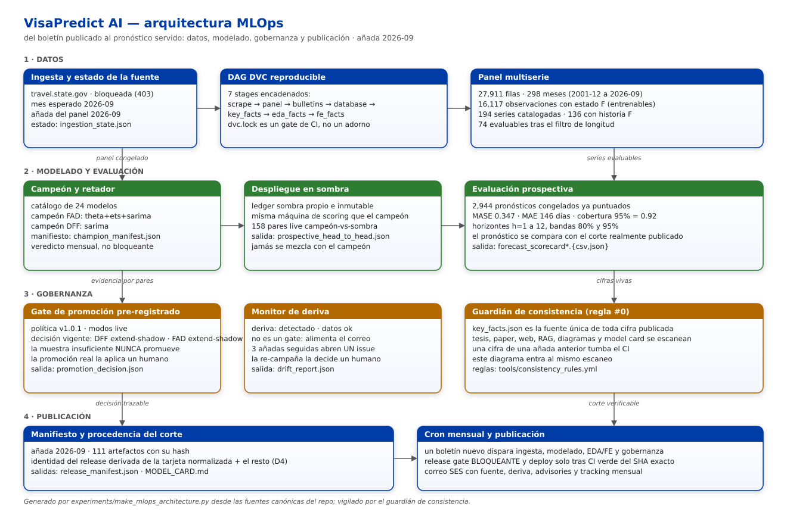

# Arquitectura MLOps de VisaPredict AI



Una vista: cómo un boletín publicado por el Departamento de Estado se convierte en un
pronóstico servido, y qué lo mantiene honesto por el camino. El diagrama y esta página los
genera `experiments/make_mlops_architecture.py` desde las fuentes canónicas del repositorio
(`make mlops-architecture`); ninguna cifra se teclea y el guardián de consistencia vigila
ambos artefactos, así que una añada vieja aquí tumba el CI igual que en la tesis o en el sitio.

## Las cuatro capas

**1 · Datos.** La ingesta observa la fuente y deja su veredicto en `ingestion_state.json`
(hoy bloqueada por el WAF, HTTP 403); cuando hay boletín nuevo, el **DAG de DVC** lo propaga por sus
7 stages encadenados —scrape → panel → bulletins → database → key_facts → eda_facts → fe_facts— y `dvc.lock` es un
gate de CI, así que la reproducibilidad no depende de la memoria de nadie. El panel resultante
es la única entrada del modelado.

**2 · Modelado y evaluación.** Un catálogo de 24 modelos alimenta el veredicto
**campeón-retador**; el campeón vigente vive en `champion_manifest.json`. El **despliegue en
sombra** congela la añada del retador en un ledger propio e inmutable y se puntúa con la misma
maquinaria que el campeón, nunca mezclada con él. La **evaluación prospectiva** compara cada
pronóstico congelado contra el corte realmente publicado después: es la única medida honesta
del sistema, y hoy acumula 2,944 predicciones puntuadas.

**3 · Gobernanza.** El **gate de promoción** está *pre-registrado* (política
v1.0.1, modos live): se fijó con cero pares live a la
vista, la muestra insuficiente nunca promueve y la promoción real la aplica un humano. El
**monitor de deriva** no bloquea: alimenta el correo y, tras tres añadas seguidas, abre un único
issue. El **guardián de consistencia** hace cumplir la regla #0 —todo alineado siempre— usando
`key_facts.json` como fuente única de cifras para tesis, paper, sitio, RAG, model card y también
para este diagrama.

**4 · Publicación.** El **manifiesto de release** (*provenance* del corte) lo sella con su identidad y el hash de
cada artefacto, y desde D4 esa identidad se deriva de la tarjeta normalizada junto al resto de
artefactos, sin ciclo. El **cron mensual** encadena todo: ingesta, modelado, EDA/FE, gobernanza,
un release gate bloqueante y un deploy que solo ocurre tras el CI verde del SHA exacto; el correo
SES resume fuente, deriva, advisories y el tracking mensual de la corrida.

## Estado vigente y su fuente

Cada fila se lee en tiempo de generación del archivo que la nombra: si el archivo cambia y nadie
regenera, la prueba `test_committed_artifacts_match_the_generator` lo dice.

| Dato | Valor | Fuente canónica |
|---|---|---|
| Panel | 27,911 filas · 298 meses · 16,117 con estado F | `reports/governance/key_facts.json` |
| Series | 194 catalogadas · 136 con historia F · 74 evaluables | `reports/governance/key_facts.json` |
| Catálogo de modelos | 24 modelos | `reports/governance/key_facts.json` |
| Evaluación prospectiva | 2,944 puntuadas · MASE 0.347 · MAE 146 días · cobertura 0.92 | `reports/governance/key_facts.json` |
| Corte publicado | añada 2026-09 · 111 artefactos | `reports/release/release_manifest.json` |
| Estado de la fuente | bloqueada por el WAF, HTTP 403 · mes esperado 2026-09 | `reports/governance/ingestion_state.json` |
| Gate de promoción | 158 pares live · política v1.0.1 · DFF: extend-shadow · FAD: extend-shadow | `reports/governance/promotion_decision.json` |
| Campeones | DFF: sarima · FAD: theta+ets+sarima | `reports/governance/champion_manifest.json` |
| Deriva | detectada · datos ok | `reports/governance/drift_report.json` |
| DAG | scrape → panel → bulletins → database → key_facts → eda_facts → fe_facts | `dvc.yaml` |
| Procedencia del panel | hash `07d43c029953` | `reports/governance/key_facts.json` |

Corte servido en producción: `2026-09-158ec972c234`.

## Cómo se regenera y se verifica

```bash
make mlops-architecture     # reescribe el SVG y esta página desde las fuentes canónicas
make consistency            # el guardián valida ambos artefactos contra key_facts.json
```

Las pruebas de `tests/test_mlops_architecture.py` fijan el contrato: los artefactos commiteados
son los que el generador produce, cada número visible procede de una fuente canónica, los nueve
bloques del encargo están documentados, el generador no escribe fuera de `docs/`, y una cifra de
una añada anterior sembrada en cualquiera de los dos artefactos hace fallar al guardián.
