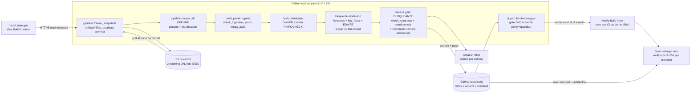

# Threat Model — VisaPredict AI · Pipeline de datos (`UACJ-MIAAD/VisaPredictAI`)

> US J5 del plan `PLAN_AUDITORIA_TRES_REPOS_MLOPS_CLEAN_CODE_2026-07-12.md`.
> **Owner:** Javier Rebull (`jrebull`). **Fecha:** 2026-07-12. **Próxima revisión completa:** 2027-07 (ver §7).
> Documento hermano del producto web: `VisaPredictAI_web/docs/THREAT_MODEL.md`.
> Política de SLA compartida: `docs/SECURITY_TRIAGE.md` (critical 48 h · high 7 días · moderate 30 días · low mejor esfuerzo).

## 1. Alcance y método

Cubre la cadena completa **scrape → S3 → panel → DuckDB → modelado → release → web**, más el
correo SES y la cadena de suministro de CI/cron (GitHub Actions, locks, contenedores). Método:
**DFD + STRIDE por etapa**, con foco en (a) *supply chain* (OIDC, actions pinneadas, locks con
hashes), (b) *integridad de datos* (gates fail-closed, ledger v2, manifiesto content-addressed)
y (c) el canal SES. Cada amenaza cita la mitigación existente en código/workflow, el riesgo
residual honesto, owner y SLA. Los datos del dominio son **públicos** (Visa Bulletin oficial):
la propiedad crítica de este repo es INTEGRIDAD y DISPONIBILIDAD, no confidencialidad.

Fuera de alcance: la superficie servida al usuario final (CSP, proxy VisaBot, Blobs) — vive en
el threat model del repo web; los experimentos GPU efímeros en EC2 (`aws_gpu/`, instancia
terminada, disparo manual del autor) se cubren solo como nota en §4.6.

## 2. Activos

| Activo | Dónde vive | Propiedad crítica |
|---|---|---|
| HTML crudo congelado (fuente de verdad histórica) | `s3://visapredictai-raw-snapshots/raw-html/` (versioning ON) + `data/snapshots/` local (gitignored) | Integridad + disponibilidad (la fuente oficial pierde boletines viejos) |
| Panel y almacén (`visa_panel_long.csv`, `.duckdb`) | `data/processed/` (CSV versionado en git; DuckDB regenerable) | Integridad (es la base de TODAS las cifras de la tesis y del web) |
| Artefactos de gobernanza y evaluación (`key_facts`, `eda_facts`, `fe_facts`, scorecards, model card) | `reports/governance/`, `reports/eval/`, `reports/eda/`, `reports/fe/` | Integridad (regla #0: cifras alineadas cross-artefacto) |
| Ledger prospectivo + añadas sombra | `reports/prospective/` (`forecast_log*.csv`) | Integridad append-only (evidencia de promoción; reescribirlo invalida decisiones) |
| Release manifest | `reports/release/release_manifest.json` | Integridad (raíz de confianza que consume el build del web) |
| Identidad del repo (historia single-author, rama `main`) | GitHub `UACJ-MIAAD/VisaPredictAI` | Integridad + política anti-coautoría de IA |
| Credenciales | **CERO keys estáticas**: role OIDC `gh-actions-visapredict` (AWS); secrets del repo: build hook de Netlify | Confidencialidad |
| Canal SES (heartbeat/alertas) | From `noreply@visapredictai.com` → buzón del autor | Autenticidad (un heartbeat falso enmascara fallos) |

## 3. Arquitectura — DFD

**Fronteras de confianza:** (1) internet ↔ scraper (el HTML remoto es input hostil);
(2) runner de Actions ↔ AWS (OIDC, sin secretos de larga vida); (3) repo `main` ↔ consumidores
(web, Overleaf, RAG) — la confianza se transporta por el manifiesto y los gates de CI, no por
fe en la rama; (4) SES ↔ buzón del autor.

## 4. Análisis STRIDE

Owner de TODAS las filas: **Javier**. SLA por severidad según `docs/SECURITY_TRIAGE.md`.

### 4.1 Ingesta (travel.state.gov → snapshots → S3)

| STRIDE | Amenaza | Mitigación existente | Riesgo residual |
|---|---|---|---|
| S/T | Upstream comprometido o respuesta adulterada (HTML falso → cifras falsas en todo el sistema) | TLS al origen; **validación pre-freeze** (`_looks_like_bulletin` + piso de links en `pipeline/freeze_snapshots.py`) rechaza páginas que no parecen boletín; escritura atómica; los gates de panel aguas abajo (§4.3) rechazan meses malformados — la cadena es **fail-closed**: prefiere no publicar a publicar basura | MEDIO-BAJO: un boletín falsificado *bien formado* (cifras plausibles, estructura correcta) pasaría los gates sintácticos. Detección tardía: mega_audit (retros/inversiones anómalas) + revisión humana del correo SES. Aceptado — requiere compromiso del sitio del Departamento de Estado |
| T | Pérdida/borrado del histórico | S3 con **versioning ON** es la fuente de verdad (la oficial pierde boletines); `data/snapshots/` local es réplica; skip-if-exists evita re-descargas destructivas; el sync a S3 corre DESPUÉS del push (orden que evita respaldar estados no validados) | BAJO. Residual: borrado a nivel cuenta AWS (§4.6) |
| D | Sitio oficial caído / formato cambiado | El cron aísla fallos por link (4xx fast-fail), reporta meses perdidos, y `watchdog.yml` (dead-man switch semanal) abre issue si >4 días sin corrida verde; 20 años de deriva de formato ya absorbidos por los parsers robustos | BAJO — un cambio de formato detiene la ingesta ruidosamente (correo SES + watchdog), nunca ingiere en silencio |

### 4.2 Supply chain de CI/cron (GitHub Actions, dependencias, contenedores)

| STRIDE | Amenaza | Mitigación existente | Riesgo residual |
|---|---|---|---|
| E | Action de terceros comprometida (tag re-apuntado) | **TODAS las actions pinneadas por SHA de commit** en los 5 workflows (`checkout`, `setup-python`, `configure-aws-credentials`, `github-script`, `upload-artifact`); `permissions: {}` por defecto y permisos por job (mínimo privilegio) | BAJO: queda el compromiso del SHA ya pinneado (colisión o publicación maliciosa previa al pin) — no mitigable localmente |
| E | Robo de credenciales AWS desde el runner | **Role OIDC `gh-actions-visapredict` sin keys estáticas** (trust limitado a este repo/rama `main`; `id-token: write` solo en el job que lo necesita); política mínima Put/Get/List + `ses:SendEmail`, **sin Delete**; las keys estáticas viejas fueron desactivadas y sus secrets borrados (2/3-jul-2026) | BAJO: un job malicioso ya ejecutándose en `main` puede asumir el role, pero su blast radius es escribir objetos S3 (versionados, recuperables) y mandar correo |
| T | Dependencia Python comprometida o con CVE | **Locks por perfil × plataforma** (`locks/`; Linux con `--require-hashes` en runtime/dev), constraints en el perfil model; `pip-audit` semanal sobre los locks con **gate** (runtime/dev vetan; model con allowlist explícita `--ignore-vuln` atada 1:1 al triage); SBOM CycloneDX por corrida; toolchain de instalación pinneado (`pip`/`setuptools`/`wheel`); pin nuevo ⇒ regenerar locks en el MISMO commit | MEDIO-BAJO: 9 avisos aceptados del perfil model (torch/transformers/etc., superficie OFFLINE sin tráfico — triage en `SECURITY_TRIAGE.md`); hash-checking no cubre el perfil model (documentado: constraints no admiten hashes) |
| T | Contenedor del gate LaTeX manipulado | Imagen `texlive/texlive` **pinneada por digest**; el job no ve secretos | BAJO |
| T | Commit con co-autoría de IA o identidad ajena | Hook `commit-msg` (`tools/check_no_coauthor.sh`, invocado vía bash) + job CI `commit-policy` como backstop (escanea mensajes: trailers de co-autor, URLs del vendor) | BAJO — política, no seguridad dura; un push directo malicioso lo paran las protecciones de la cuenta, no este hook |
| E | Toma de la cuenta GitHub del autor (raíz de confianza de TODO) | Single-author; el daño operativo lo acotan los gates (un push que rompa contratos/consistencia deja CI rojo y el deploy del web NO dispara) | **ALTO impacto / baja probabilidad** — es el riesgo residual #1 (§6-R1). Higiene de cuenta (2FA/llaves) es responsabilidad del autor; verificar en revisión anual |

### 4.3 Transformación (parse offline → panel → DuckDB)

| STRIDE | Amenaza | Mitigación existente | Riesgo residual |
|---|---|---|---|
| T | Parser engañado por HTML raro → filas corruptas | Parse 100 % OFFLINE sobre snapshots congelados (sin red en `pipeline/scrape_all.py`); `classify_status` valida tokens con `strptime`; suite de parsers/extracción/integridad (fixtures reales); `raw_value`/`raw_category` preservan la celda original (auditable) | BAJO |
| T | Panel degradado publicado en silencio | Gates duros en el cron: `tools/check_ingestion.py --mode assert` (combos bloque×tabla del mes nuevo + piso de filas), pisos por país y % de filas F, completitud de meses EXIGIDA por tests, `pipeline/mega_audit.py` con exit code en CRIT; commit scoped (`git add data reports`) | BAJO — el modo de fallo es "no publica este mes", no "publica mal" |
| T | Divergencia CSV ↔ DuckDB | Build atómico (`*.tmp.duckdb` + `os.replace`); constraints PK/FK/CHECK = contrato en la carga (`schema.sql`); `_connect` exige `etl_run==1` y frescura DB↔CSV (modelado ABORTA sobre BD stale); test ancla el epoch del SQL al de `vp_data.config` | BAJO |
| R | "¿Este dato de dónde salió?" (no repudio del ETL) | Tabla de gobernanza `etl_run` con score; cleaning ledger determinista por build (`reports/governance/cleaning_ledger.json`); decisiones centralizadas en `vp_data/cleaning.py::CLEANING_DECISIONS` + `docs/CLEANING.md` | BAJO |

### 4.4 Modelado y evidencia (forecasts, key_facts, ledger, promoción)

| STRIDE | Amenaza | Mitigación existente | Riesgo residual |
|---|---|---|---|
| T | Reescritura del ledger prospectivo (evidencia adulterada) | **Ledger v2 fail-closed** (`vp_model/ledger.py`): cada fila con `forecast_id` (identidad clave+receta) y `row_hash` (contenido en forma canónica); `validate()` re-deriva ambos hashes sobre TODAS las filas y ambos productores validan el archivo persistido tras cada append; regla live-vs-vintage | BAJO: quien controle el repo puede regenerar hashes coherentes (→ §6-R1); contra corrupción accidental o edición parcial es hermético |
| T | Serie omitida en silencio de una añada | **Completitud por IGUALDAD de sets** contra el catálogo vigente (`ledger.completeness_problems`); excepciones solo NOMINALES en `completeness_allowlist.json` (motivo + expiración calendárica real, tope temporal; entrada malformada revienta); exenciones visibles en log Y en el correo SES | BAJO |
| T | Promoción de modelo con evidencia ajena/stale | **Promoción ligada por identidad** (`vp_model/promotion.py`): la decisión porta hash canónico de la política íntegra + recetas EXACTAS del ledger (igualdad de sets vía shadow evidence) + hashes de evidencia FILTRADOS a las añadas de la decisión; `authorize()` es fail-closed | BAJO |
| T | Cifras desalineadas entre artefactos (regla #0) | Guardián `tools/check_consistency.py` (CI + pre-push + cron→SES): motor decimal, tripwires de valores/frases muertos, reglas REQUIRED (acepta forma macro), escanea ~118 artefactos incluidos componentes del repo web; `key_facts`/`fe_facts` DERIVADOS (el .tex los consume por `\input`) | BAJO para los artefactos vigilados; los no listados en `consistency_rules.yml` quedan fuera (añadir superficie nueva a las reglas es parte del checklist de review) |
| T | Outputs DVC desincronizados del código | Gate E2 en CI (dvc.lock fresco obligatorio en el mismo commit que toca stages/deps; ha detonado 4+ veces — el gate funciona) | BAJO |

### 4.5 Release y publicación (manifest → CI → Netlify → web)

| STRIDE | Amenaza | Mitigación existente | Riesgo residual |
|---|---|---|---|
| T | Publicar un árbol inconsistente como release | **Release gate BLOQUEANTE** en el cron: restaura el árbol a lo COMMITEADO, corre `tools/check_contracts.py` (14 contratos con `required_paths`, añada única, `git cat-file -e` del SHA — fail-closed en shallow) + consistencia, y solo entonces sella el **manifiesto content-addressed** (`experiments/build_release_manifest.py`; git_sha siempre resoluble, suciedad declarada aparte en `worktree_dirty`); **coherencia manifiesto↔árbol gateada** (artefacto listado que cambió o desapareció rompe el gate) | BAJO |
| T | Deploy del web sobre un SHA no verificado | El hook de Netlify SOLO dispara tras **CI VERDE del SHA exacto** (`gh run watch` con timeout real, fail-closed); el build del web re-verifica **SHA-256 y tamaño por artefacto** contra el manifest y valida contratos vendorizados (defensa en profundidad cross-repo) | BAJO. Un EDA rojo ⇒ sin release ese mes (jamás se reusa un manifiesto viejo en silencio) — costo asumido: disponibilidad antes que integridad falsa |
| S | Consumidor engañado sobre QUÉ corte se sirve | `release_id` content-addressed + `/data/release-state.json` en el web publica la identidad de los bytes SERVIDOS | BAJO |
| I | Fuga del build hook de Netlify (secret del repo) | Único secret restante del repo; su alcance es "disparar un build" (el build re-verifica todo) | BAJO — abuso = builds espurios, no datos falsos |

### 4.6 AWS (S3, SES) y periferia

| STRIDE | Amenaza | Mitigación existente | Riesgo residual |
|---|---|---|---|
| E | Compromiso de la cuenta AWS | Sin keys estáticas activas (OIDC only); política del role mínima **sin Delete**; S3 con versioning (recuperación ante sobrescritura); blast radius acotado: S3 raw + SES | MEDIO-BAJO: la cuenta raíz/consola sigue siendo del autor (2FA, verificar anualmente). El repo git conserva una copia íntegra de todo lo derivado; solo el HTML crudo depende de S3 |
| S | **Heartbeat SES falsificado** (correo "todo verde" que enmascara un fallo real) | Dominio propio con **DKIM verificado + SPF + DMARC publicados** (`visapredictai.com`) — un tercero no puede firmar como `noreply@visapredictai.com`; el destino (M365, SPF `-all`) rechaza/cuarentena lo no alineado | BAJO. Nota: el canal correo es *señal*, no *control* — el estado real lo dicen CI y el watchdog (que abre issue, canal independiente) |
| I | El correo revela detalles operativos | Contenido = métricas de corrida y líneas de gates hacia el buzón del autor; sin secretos en el cuerpo | BAJO |
| D | SES suspendido / correo no entregado | `watchdog.yml` es el dead-man switch independiente (issue en GitHub si >4 días sin corrida verde) — la ausencia de heartbeat no depende del mismo canal que falla | BAJO |
| E | Experimentos GPU en EC2 (`aws_gpu/`) | Instancias efímeras disparadas manualmente por el autor, terminadas al concluir; bundle con requirements pinneados; nada del path de producción depende de ellas | BAJO (superficie intermitente; revisar si se vuelve recurrente) |

## 5. Decisiones de diseño de seguridad (no revertir)

- **Fail-closed en toda la cadena**: validación pre-freeze, gates de ingesta, ledger
  `validate()`, `authorize()`, release gate, deploy tras CI verde. El modo de fallo canónico es
  "este mes no se publica", jamás "se publica algo no verificado".
- **Sin credenciales estáticas**: OIDC para AWS; CI sin secretos; el único secret del repo es
  el build hook (bajo valor).
- **Identidad por contenido, no por confianza**: `row_hash`/`forecast_id` en el ledger, hashes
  de evidencia en la promoción, manifiesto content-addressed, SHA del deploy. Un cambio
  legítimo se re-sella explícitamente; uno ilegítimo CONOCIDO muere con un test que lo
  reproduce (claim acotado — el catálogo lo definen las rondas de auditoría, no una prueba de
  completitud).
- **Canales de alerta redundantes**: correo SES por corrida + watchdog semanal por issue +
  CI rojo. Ningún fallo depende de un solo canal para hacerse visible.

## 6. Riesgos residuales top-5 (datos)

1. **R1 — Cuenta GitHub del autor = raíz de confianza única.** Quien controle
   `UACJ-MIAAD/VisaPredictAI@main` puede re-sellar manifest, ledger y hashes de forma
   coherente; el web lo consumiría como legítimo. Mitigación real: higiene de cuenta (2FA);
   los gates convierten el sabotaje *torpe* en CI rojo, no el sabotaje competente.
2. **R2 — Boletín upstream falsificado bien formado** pasaría los gates sintácticos; la
   detección es estadística (mega_audit) y humana (correo SES). Probabilidad muy baja
   (requiere comprometer al Departamento de Estado o un MITM con TLS roto).
3. **R3 — CVEs aceptados del perfil model** (torch, transformers, lightning… sin fix
   publicado o con fix breaking): superficie offline sin tráfico, allowlist 1:1 con el triage,
   re-evaluación mensual (`SECURITY_TRIAGE.md`).
4. **R4 — Ventana de sabotaje pre-gate**: código malicioso ya mergeado a `main` corre EN el
   runner del cron con el role OIDC asumible (escritura S3 versionada + SES). Acotado por el
   review de single-author y el blast radius mínimo de la política IAM.
5. **R5 — Cierre end-to-end pendiente**: el primer cron real completo post-endurecimiento
   (A-01/#7) aún no corre — hasta entonces, la cadena release→deploy está probada por
   simulacro y staleness sembrada, no por el evento real de un boletín nuevo.

## 7. Proceso de revisión

- **Revisión anual completa** (próxima: **2027-07**): recorrer §4 fila por fila contra el
  código vigente (¿el gate citado sigue existiendo y bloqueando?), re-verificar pins de
  actions/digest/locks, higiene de cuentas (2FA GitHub/AWS; role OIDC sin trust ampliado;
  cero keys estáticas re-creadas), estado de la allowlist de pip-audit contra el triage, y
  refrescar §6.
- **Revisión disparada por evento** (antes del merge del cambio):
  - **Cambio de proveedor** — almacenamiento (S3→otro: re-modelar §4.1/§4.6 y el role),
    CI (GitHub Actions→otro: TODA la §4.2), correo (SES→otro: re-verificar DKIM/SPF/DMARC),
    hosting del web (cambia el eslabón deploy de §4.5), o fuente de datos upstream.
  - Workflow nuevo o permiso nuevo en un workflow; secret nuevo; artefacto nuevo consumido por
    el web (añadirlo al manifest, a los contratos y al guardián en la misma tanda);
    dependencia nueva con superficie de red.
  - Incidente o hallazgo de auditoría (las rondas adversariales actualizan este documento en
    la misma sesión que cierran el fix).
- El diff de este documento acompaña al PR del cambio que lo dispara. Owner: Javier.
