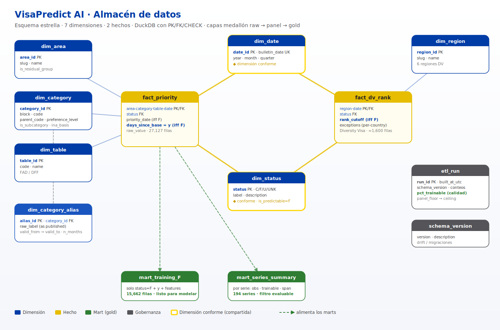
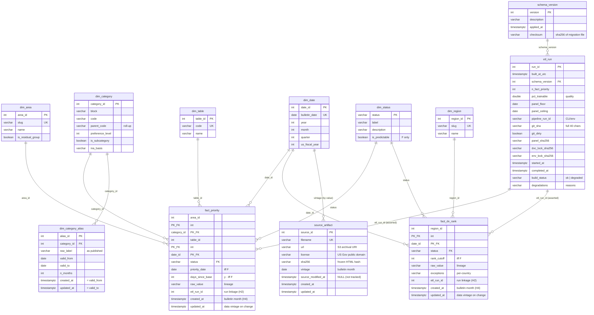

# Diagrama entidad-relación — VisaPredict AI

Modelo dimensional (esquema estrella) del almacén de datos. Diagrama de arquitectura
en [`schema_er.svg`](schema_er.svg); el ER completo (todas las columnas, PK/FK,
cardinalidad) se renderiza nativo en GitHub abajo. Definición autoritativa:
[`schema.sql`](../schema.sql) · catálogo: [`data_dictionary.md`](data_dictionary.md).



> Nota: `schema_er.svg` muestra la arquitectura de alto nivel previa a la
> migración 002 (aún sin `source_artifact` ni las columnas de procedencia); el
> ER completo de abajo sí refleja el esquema vigente.

## ER completo



## Capas medallón

```
data/raw/*.csv  ─bronze→  visa_panel_long.csv  ─silver→  estrella + marts (gold)
 (fuente cruda)            (panel tipado)                 DuckDB · mart_training_F …
```

**Dimensiones conformes** (compartidas por ambos hechos): `dim_date`, `dim_status`.
**Marts gold** (vistas para el modelado): `mart_training_F`, `mart_series_summary`.
